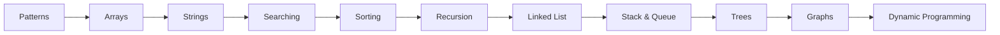
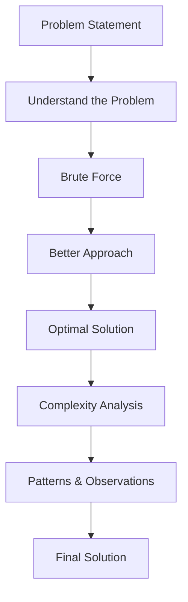

# Data Structures & Algorithms in Python


A structured collection of **Data Structures and Algorithms** solved in **Python**.

This repository is not just a collection of solutions—it documents my learning journey. Every problem includes multiple approaches, complexity analysis, mathematical reasoning (when applicable), and the thought process behind choosing one solution over another.

---

# Repository Goals

- Strengthen problem-solving skills.
- Learn multiple approaches for the same problem.
- Understand time and space complexity.
- Improve coding interview preparation.
- Build a reference for future revision.
- Practice writing clean and optimized code.

---

# Repository Structure

```
DSA/
│
├── Patterns/
│   ├── Pattern-01
│   ├── Pattern-02
│   ├── ...
│
├── Arrays/
│
├── Strings/
│
├── Two Pointers/
│
├── Sliding Window/
│
├── Binary Search/
│
├── Sorting/
│
├── Recursion/
│
├── Backtracking/
│
├── Linked List/
│
├── Stack/
│
├── Queue/
│
├── Trees/
│
├── Binary Search Tree/
│
├── Heap/
│
├── Graph/
│
├── Dynamic Programming/
│
├── Greedy/
│
├── Bit Manipulation/
│
└── README.md
```

---

# Learning Roadmap



---

# Repository Workflow

For every problem, I follow the same learning process.



---

# What Every Solution Includes

Every problem contains:

- Problem Statement
- Explanation
- Brute Force Approach
- Better Approach
- Optimal Approach
- Dry Run
- Mathematical Logic (if required)
- Time Complexity
- Space Complexity
- Interview Notes

---

# Example Learning Workflow

```
Problem

↓

Think

↓

Observe Pattern

↓

Brute Force

↓

Optimize

↓

Analyze Complexity

↓

Final Code
```

---

# Pattern Practice

Pattern problems help build logical thinking before solving complex DSA questions.

Topics include:

- Square Patterns
- Triangle Patterns
- Pyramid Patterns
- Diamond Patterns
- Hollow Patterns
- Number Patterns
- Alphabet Patterns
- Butterfly Patterns
- Pascal Triangle
- Advanced Pattern Printing

Example

```
*
**
***
****
*****
```

```
*****
****
***
**
*
```

```
    *
   ***
  *****
 *******
*********
```

---

# Problem Solving Strategy

Before writing code, I answer these questions.

```text
Can I solve it using loops?

↓

Can I reduce nested loops?

↓

Can I use a better data structure?

↓

Can mathematics help?

↓

Can Binary Search help?

↓

Can Two Pointers help?

↓

Can Dynamic Programming help?
```

---

# Approaches Covered

Depending on the problem, solutions may include:

- Brute Force
- Better Solution
- Optimal Solution
- Mathematical Formula
- Prefix Sum
- Sliding Window
- Binary Search
- Hashing
- Sorting
- Two Pointers
- Greedy
- Dynamic Programming
- Recursion
- Backtracking
- Graph Traversal

---

# Complexity Analysis

Every solution includes

```
Time Complexity

↓

Space Complexity

↓

Why this complexity?
```

Example

```
Brute Force

Time : O(n²)

Space : O(1)
```

```
Optimal

Time : O(n)

Space : O(1)
```

---

# Mathematical Optimizations

Whenever possible, problems are solved using mathematical concepts such as:

- Logarithms
- Bit Manipulation
- Number Theory
- Powers of Two
- Prime Numbers
- Modular Arithmetic
- Mathematical Observations

Example

Instead of counting digits manually

```
while num > 0
```

Use

```
digits = floor(log10(num)) + 1
```

---

# Coding Standards

Every solution follows:

- Meaningful variable names
- Clean formatting
- Comments where necessary
- Multiple approaches
- Complexity analysis
- Interview-friendly implementation

---

# Technologies

- Python
- VS Code
- Git
- GitHub

---

# Skills Developed

- Logical Thinking
- Pattern Recognition
- Algorithm Design
- Complexity Analysis
- Optimization
- Mathematical Reasoning
- Interview Preparation

---

# Repository Progress

Topics covered include:

- [x] Pattern Printing
- [ ] Arrays
- [ ] Strings
- [ ] Sorting
- [ ] Searching
- [ ] Recursion
- [ ] Linked List
- [ ] Stack
- [ ] Queue
- [ ] Trees
- [ ] Graphs
- [ ] Dynamic Programming
- [ ] Greedy Algorithms
- [ ] Bit Manipulation

---

# Why This Repository?

Instead of memorizing solutions, this repository focuses on understanding:

- Why a solution works
- When to use a particular algorithm
- How to optimize brute-force solutions
- Trade-offs between different approaches
- Interview problem-solving techniques

---

# Future Plans

- Solve 300+ DSA problems
- Add visual dry runs
- Include algorithm flowcharts
- Add complexity comparison tables
- Cover advanced graph algorithms
- Cover advanced dynamic programming
- Add competitive programming problems

---

# Connect With Me

**GitHub:** https://github.com/Vedant021004

**LinkedIn:** https://www.linkedin.com/in/vedant-kapil-8a786740a/

---

# Final Note

> "A good programmer knows how to write code. A great programmer knows why that code works."

This repository is my effort to understand algorithms from first principles—starting with brute force, discovering patterns, applying mathematical insights, and finally arriving at efficient solutions.
